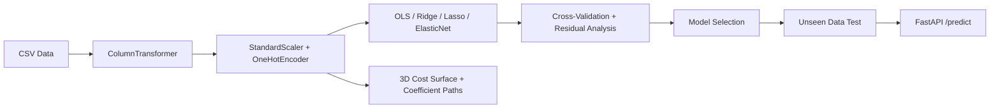

# The Linear Regression Engine

---

## Overview

This project builds a complete, production-quality linear regression pipeline from mathematical first principles. It covers Ordinary Least Squares (OLS), Ridge (L2), Lasso (L1), and Elastic Net regularization — applied to two independent datasets from entirely different domains to demonstrate the universality of the technique.

The goal is not just to fit a line. It is to understand *why* the math works, *what* regularization actually does geometrically, and *how* to make principled decisions about model selection and hyperparameter tuning.

---

## Datasets

### Dataset A: Artisan Cheese Fermentation Time Prediction

A synthetic dataset of 2,000 artisan cheese batches. The task is to predict the optimal fermentation time (in hours) based on biochemical and environmental conditions including milk fat percentage, starter culture pH, ambient temperature, humidity, salt concentration, curd cut size, aging room airflow, and bacterial strain type.

This dataset is designed to be scientifically grounded in fermentation biochemistry while being completely novel as a machine learning benchmark.

### Dataset B: Silicon Fmax Prediction (Post-Silicon Validation)

A synthetic dataset of 2,000 silicon characterization measurements. The task is to predict the maximum stable clock frequency (Fmax in MHz) based on voltage, temperature, leakage current, ring oscillator speed, thermal resistance, IR drop estimate, and silicon lot ID.

This represents a real post-silicon validation use case: predicting chip performance at untested voltage and temperature corners to reduce physical characterization time.

---

## What This Project Covers

| Concept | Description |
|:---|:---|
| **Ordinary Least Squares (OLS)** | Closed-form Normal Equation and iterative Gradient Descent implementations from scratch |
| **Cost Function** | MSE as a convex bowl in coefficient space; 3D visualization |
| **Gradient Descent** | Learning rate analysis, convergence behavior, update rule derivation |
| **Ridge (L2) Regularization** | Sphere constraint, coefficient shrinkage, no feature elimination |
| **Lasso (L1) Regularization** | Diamond constraint, automatic feature selection, sparsity |
| **Elastic Net** | Combined L1+L2 penalty for correlated feature sets |
| **Cross-Validation** | K-fold CV for hyperparameter selection without test set leakage |
| **Residual Analysis** | Checking model assumptions through residual diagnostics |
| **Feature Preprocessing** | StandardScaler, OneHotEncoder, ColumnTransformer pipelines |

---

## Repository Structure

```
001_linear_regression_engine/
├── assets/                                        # All notebook-generated visualizations
│   ├── proj1_cheese_eda.png                       # Cheese: target distribution + correlation heatmap
│   ├── proj1_cheese_gd_convergence.png            # Cheese: gradient descent MSE vs iteration
│   ├── proj1_cheese_coefficient_paths.png         # Cheese: Ridge vs Lasso coefficient shrinkage paths
│   ├── proj1_cheese_train_vs_test.png             # Cheese: actual vs predicted (train + test)
│   ├── proj1_cheese_residuals.png                 # Cheese: 3-panel residual diagnostics
│   ├── proj1_cheese_unseen.png                    # Cheese: unseen data performance (500 samples)
│   ├── proj1_cheese_flowchart.png                 # Cheese: AI-generated pipeline flowchart
│   ├── proj2_fmax_eda.png                         # Fmax: 6 feature-vs-target scatter plots
│   ├── proj2_fmax_cost_surface_3d.png             # Fmax: 3D MSE cost surface with GD path
│   ├── proj2_fmax_l1_l2_contours.png              # Fmax: L1 diamond vs L2 circle geometry
│   ├── proj2_fmax_train_vs_test.png               # Fmax: actual vs predicted (train + test)
│   ├── proj2_fmax_unseen.png                      # Fmax: unseen silicon lots performance
│   └── proj2_fmax_flowchart.png                   # Fmax: AI-generated pipeline flowchart
├── data/
│   ├── artisan_cheese_fermentation_data.csv       # 2,000 cheese batches (8 features + target)
│   └── silicon_fmax_validation_data.csv           # 2,000 silicon samples (7 features + target)
├── deploy/
│   ├── Dockerfile                                 # Container image for FastAPI server
│   ├── docker-compose.yml                         # Single-command deployment
│   ├── nginx.conf                                 # Reverse proxy configuration
│   └── railway.json                               # Railway.app deployment config
├── docs/
│   ├── Linear_Regression_Engine_Report.html       # Report source (HTML with embedded images)
│   └── Linear_Regression_Engine_Report.pdf        # Final PDF report (both projects)
├── models/
│   ├── ridge_cheese.pkl                           # Trained Ridge model for cheese (R² = 0.93)
│   └── ridge_fmax.pkl                             # Trained Ridge model for fmax (R² = 0.9960)
├── notebooks/
│   ├── 01_linear_regression_cheese.ipynb          # Full pipeline: OLS → Ridge → Lasso → Evaluation
│   └── 02_linear_regression_fmax.ipynb            # Silicon Fmax: same pipeline + 3D/L1-L2 visuals
├── src/
│   ├── train.py                                   # Train Ridge models for both datasets
│   ├── predict.py                                 # Load model and run inference
│   ├── api.py                                     # FastAPI serving endpoint (POST /predict)
│   └── data_generator.py                          # Synthetic dataset generation
├── tests/
│   └── test_model.py                              # Model validation tests
├── web/
│   ├── generate_dashboard.py                      # Generates interactive Plotly.js dashboard
│   ├── dashboard.html                             # Production Fmax dashboard (8 charts, 8K dies)
│   └── dashboard_data.csv                         # Synthetic silicon data (50 lots × 20 wafers × 8 dies)
├── .gitignore
├── LICENSE                                        # MIT License
└── requirements.txt                               # Python dependencies
```

---

## Key Visualizations

### 3D MSE Cost Function Surface
The MSE cost function forms a convex bowl in coefficient space. Gradient Descent follows the gradient of this surface downward to the global minimum.

### L1 vs L2 Geometric Interpretation
The L2 constraint is a sphere; the L1 constraint is a diamond. The diamond has corners on the axes, making it likely that the constrained solution drives coefficients to zero — explaining Lasso's sparsity.

### Coefficient Shrinkage Paths
Ridge shrinks all coefficients gradually but never to zero. Lasso eliminates features entirely beyond a threshold. Paths are shown for both datasets.

### Train vs Test Fit Analysis
Actual vs predicted scatter plots on both training and test sets, with R² scores and 1:1 reference lines, demonstrating model generalization without overfitting.

### Unseen Data Simulation
Both notebooks simulate 500 completely new observations (never seen during training) and evaluate model performance on truly out-of-distribution data.

### Production Fmax Dashboard
An interactive Plotly.js dashboard with 8 charts across 50 lots × 20 wafers × 8 dies (8,000 records), including Fmax histogram, bin classification, lot yield trends, VDD/temperature scatter, and wafer yield heatmaps.

---

## Getting Started

```bash
# Clone the repository
git clone https://github.com/AIML-Engineering-Lab/001_linear_regression_engine.git
cd 001_linear_regression_engine

# Install dependencies
pip install -r requirements.txt

# Generate datasets
python3 src/data_generator.py

# Open notebooks
jupyter notebook notebooks/

# Train model and save artifacts (both datasets)
python3 src/train.py

# Run predictions
python3 src/predict.py

# Start API server
uvicorn src.api:app --host 0.0.0.0 --port 8000

# Run tests
python3 tests/test_model.py
```

---

## Tech Stack

| Tool | Version | Purpose |
|:---|:---|:---|
| Python | 3.11+ | Core language |
| NumPy | 1.24+ | Linear algebra, Normal Equation |
| Pandas | 2.0+ | Data manipulation |
| scikit-learn | 1.3+ | Ridge, Lasso, ElasticNet, CV |
| Matplotlib | 3.7+ | All visualizations including 3D |
| Seaborn | 0.12+ | Statistical plots |
| FastAPI | 0.100+ | REST API serving |
| Plotly.js | 2.x | Interactive dashboard |

---

## Architecture



---

## License

MIT License. See [LICENSE](LICENSE) for details.
